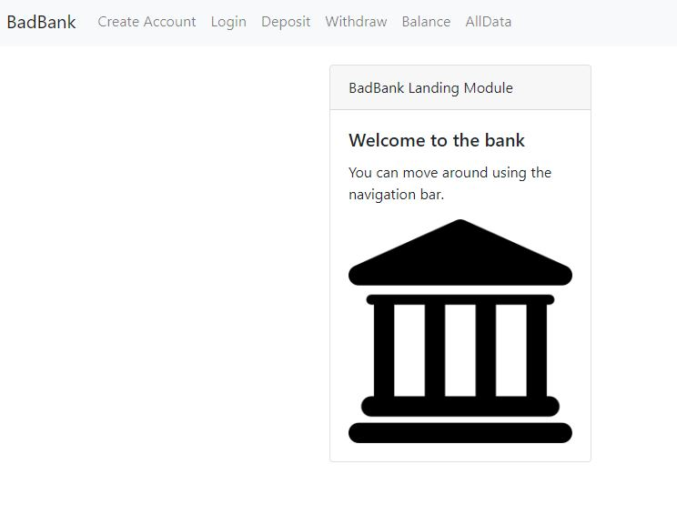
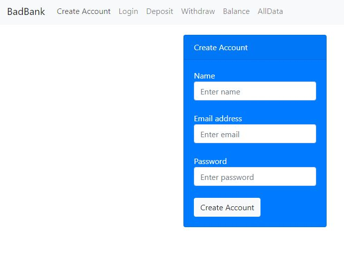
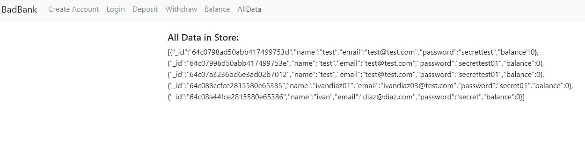
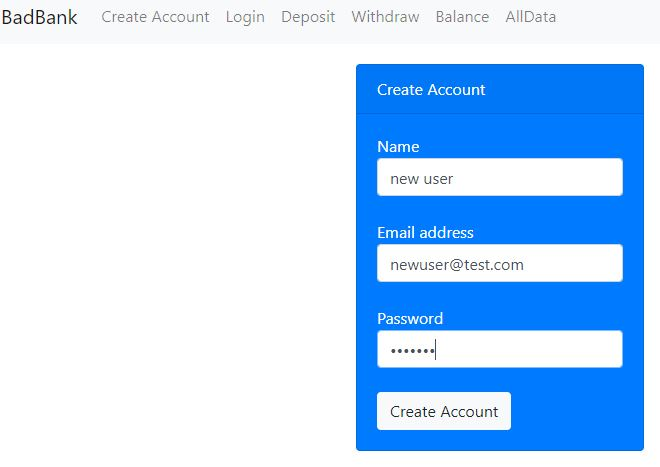
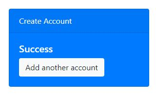
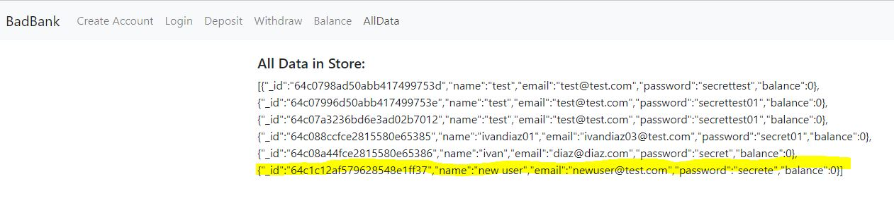
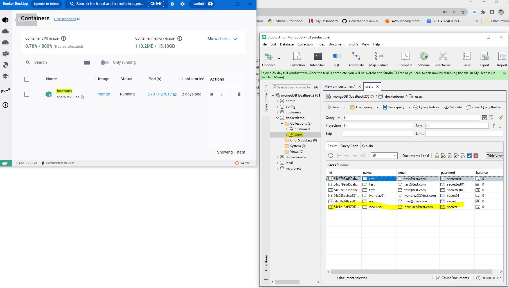

# badBank
<b>
<ul>
  <li>
    Project title: <b>Bad Bank</b>
    </img>
    </img>
    </img>
    
  </li>
  <li>
    Description/Motivation: <b>Developing real application with MERN</b>
    </img>
    </img>
  </li>
  <li>
    Installation Guidelines: <b>git clone, git pull, npm init, npm install express, npm install mongodb@2.2.21, npm install cors</b>
    </img>
  </li>
  <li>
    Screenshots: <b>Images shown below</b>
    </img>
  </li>
  <li>
    Technology used: <b>NA</b>
    </img>
  </li>
  <li>
    Features: <b>Enjoy the app</b>

  </li>
  <li>
    License: <b>mongodb 2.2.21</b>
  </li>
</ul>
</b>
